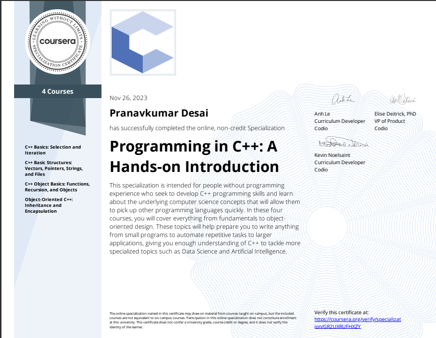

# Welcome to the Specialization Answers Repository

Hey there! I'm Pranavkumar Desai, and I'm thrilled to share with you this repository that compiles answers from all four courses of the Programming Hands-On Specialization.

## About This Repository

I spent time arranging and organizing the answers to create a comprehensive resource that brings together the best insights from the specialization. It's my way of giving back and making learning more accessible.

### Contributors

Big shoutout to the original creators of the courses – their dedication paved the way for this repository. I'm truly grateful for their impactful contributions.

I also want to highlight some awesome individuals who shared their work on GitHub, enriching this repository:

1. [sammj13](https://github.com/sammj13)
2. [shivagur](https://github.com/shivagur)

Thank you for making this a collaborative hub for knowledge!

## How to Use

## Navigating the Repository

1. **Course Organization:** Each course has its dedicated folder. Navigate to the specific course folder to find organized answers and resources.

2. **Week-wise Structure:** Answers are further categorized based on weeks within each course folder. Dive into the corresponding week to locate specific materials for your study.

3. **File Naming Convention:** Answers are named intuitively, often reflecting the question or topic. Use the clear file naming convention to quickly identify and access the answers you're looking for.

# Certificate

